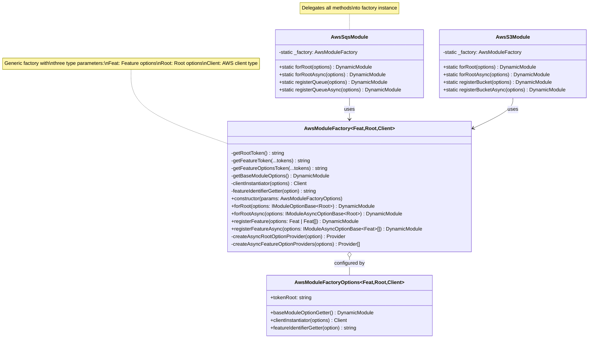
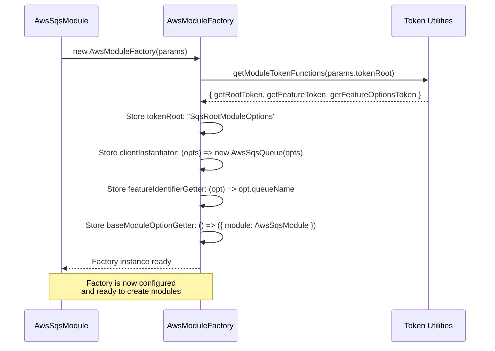
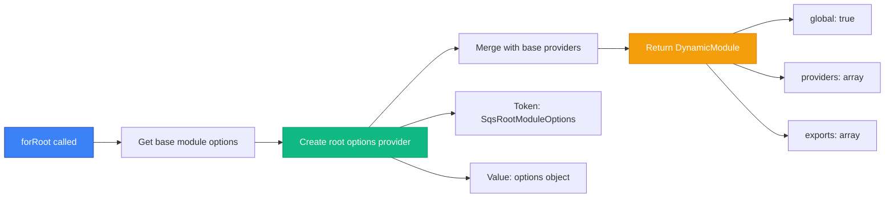
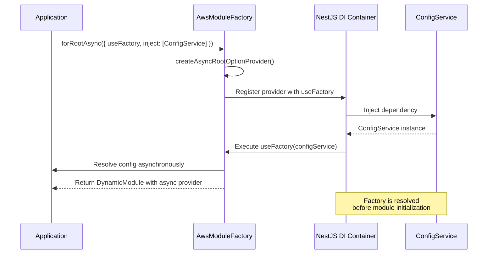
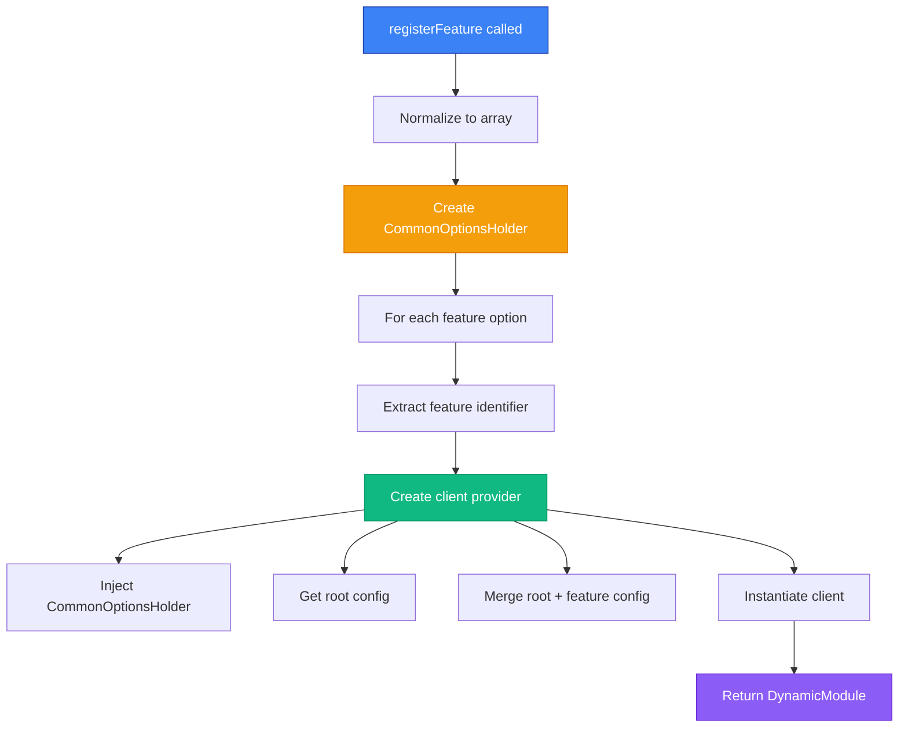
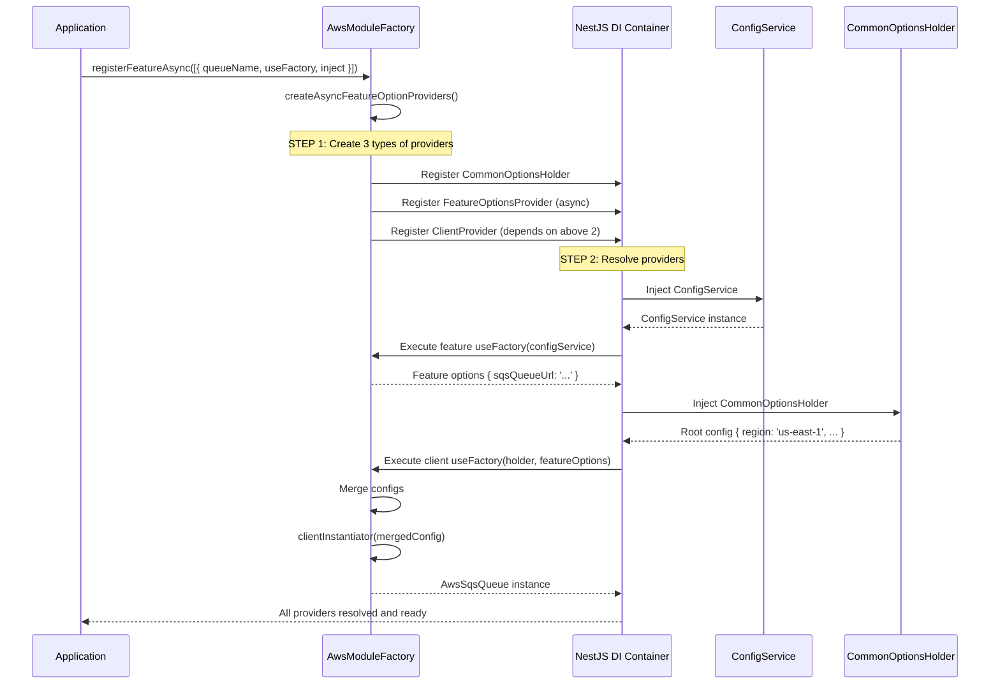

# Factory Pattern Deep Dive

## Introduction

The `AwsModuleFactory` is the heart of the NestJS AWS Toolkit. It's a **generic factory** that eliminates code duplication by providing a reusable pattern for creating AWS service modules. This document provides a comprehensive analysis of its implementation, design, and usage.

## The Problem It Solves

### Without Factory Pattern

```typescript
// ❌ SQS Module Implementation (150 lines)
@Module({})
export class AwsSqsModule {
  static forRoot(options: ISqsOptions): DynamicModule {
    return {
      module: AwsSqsModule,
      providers: [
        {
          provide: 'SQS_ROOT_OPTIONS',
          useValue: options
        }
      ],
      exports: [/* ... */]
    };
  }

  static forRootAsync(options: IAsyncSqsOptions): DynamicModule {
    return {
      module: AwsSqsModule,
      providers: [
        {
          provide: 'SQS_ROOT_OPTIONS',
          useFactory: options.useFactory,
          inject: options.inject || []
        }
      ],
      exports: [/* ... */]
    };
  }

  static registerQueue(options: IQueueOptions): DynamicModule {
    // 50+ lines of provider creation logic...
  }

  static registerQueueAsync(options: IAsyncQueueOptions): DynamicModule {
    // 50+ lines of async provider creation logic...
  }
}

// ❌ S3 Module Implementation (150 lines - MOSTLY DUPLICATE CODE)
@Module({})
export class AwsS3Module {
  static forRoot(options: IS3Options): DynamicModule {
    // Almost identical to SQS forRoot...
  }

  static forRootAsync(options: IAsyncS3Options): DynamicModule {
    // Almost identical to SQS forRootAsync...
  }

  static registerBucket(options: IBucketOptions): DynamicModule {
    // Almost identical to SQS registerQueue...
  }

  static registerBucketAsync(options: IAsyncBucketOptions): DynamicModule {
    // Almost identical to SQS registerQueueAsync...
  }
}

// Problem: 90% code duplication across AWS service modules!
```

### With Factory Pattern

```typescript
// ✅ Generic Factory (150 lines - REUSABLE)
export class AwsModuleFactory<Feat, Root, Client> {
  public forRoot(options: IModuleOptionBase<Root>): DynamicModule { /* ... */ }
  public forRootAsync(options: IModuleAsyncOptionBase<Root>): DynamicModule { /* ... */ }
  public registerFeature(options: Feat | Feat[]): DynamicModule { /* ... */ }
  public registerFeatureAsync(options: IModuleAsyncOptionBase<Feat>[]): DynamicModule { /* ... */ }
}

// ✅ SQS Module (20 lines - CONFIGURATION ONLY)
@Module({})
export class AwsSqsModule {
  private static _factory = new AwsModuleFactory({
    tokenRoot: 'SqsRootModuleOptions',
    clientInstantiator: (options) => new AwsSqsQueue(options),
    featureIdentifierGetter: (opt) => opt.queueName,
    baseModuleOptionGetter: () => ({ module: AwsSqsModule })
  });

  static forRoot = (options) => AwsSqsModule._factory.forRoot(options);
  static forRootAsync = (options) => AwsSqsModule._factory.forRootAsync(options);
  static registerQueue = (options) => AwsSqsModule._factory.registerFeature(options);
  static registerQueueAsync = (options) => AwsSqsModule._factory.registerFeatureAsync(options);
}

// ✅ S3 Module (20 lines - CONFIGURATION ONLY)
@Module({})
export class AwsS3Module {
  private static _factory = new AwsModuleFactory({
    tokenRoot: 'S3RootModuleOptions',
    clientInstantiator: (options) => new AwsS3Client(options),
    featureIdentifierGetter: (opt) => opt.bucketName,
    baseModuleOptionGetter: () => ({ module: AwsS3Module })
  });

  // Delegate to factory...
}

// Result: 150 LOC (factory) + 20 LOC (SQS) + 20 LOC (S3) = 190 LOC
// vs 150 + 150 = 300 LOC without factory
// Savings: 37% code reduction with just 2 services!
// With 10 services: 150 + (20 × 10) = 350 LOC vs 1500 LOC = 77% reduction!
```

## Factory Architecture

### Class Diagram



### Type Parameters Explained

```typescript
class AwsModuleFactory<Feat extends Partial<Root>, Root, Client = any>
                      │                           │      │
                      │                           │      └─ AWS Client type (e.g., SQSClient, S3Client)
                      │                           │
                      │                           └─ Root configuration type (shared across features)
                      │
                      └─ Feature configuration type (inherits from Root, can override)
```

**Example:**

```typescript
// SQS Module Type Parameters
type Root = IAwsSqsModuleOptions;                    // { region, credentials, ... }
type Feat = IAwsSqsFeatureModuleOptions;             // { queueName, region?, ... }
type Client = AwsSqsQueue;                           // Queue wrapper class

// Constraint: Feat extends Partial<Root>
// This ensures feature options can override any root option
```

**ASCII Visualization:**

```
┌────────────────────────────────────────────────────┐
│  Type Parameter Hierarchy                         │
├────────────────────────────────────────────────────┤
│                                                    │
│  Root (Base Configuration)                        │
│  ┌──────────────────────────────────────┐         │
│  │ region: string                       │         │
│  │ credentials: AwsCredentials          │         │
│  │ apiVersion: string                   │         │
│  │ sqsQueueUrl?: string                 │         │
│  │ messageGroupId?: string              │         │
│  └──────────────────────────────────────┘         │
│           △                                        │
│           │ extends Partial<Root>                 │
│           │                                        │
│  Feat (Feature Configuration - can override)      │
│  ┌──────────────────────────────────────┐         │
│  │ queueName: string      ← REQUIRED    │         │
│  │ region?: string        ← OVERRIDE    │         │
│  │ credentials?: ...      ← OVERRIDE    │         │
│  │ sqsQueueUrl?: string   ← OVERRIDE    │         │
│  └──────────────────────────────────────┘         │
│           │                                        │
│           │ merged into                           │
│           ▼                                        │
│  Client Instance Configuration                    │
│  ┌──────────────────────────────────────┐         │
│  │ { ...rootConfig, ...featureConfig }  │         │
│  │ ↓                                    │         │
│  │ new AwsSqsQueue(mergedConfig)        │         │
│  └──────────────────────────────────────┘         │
│                                                    │
└────────────────────────────────────────────────────┘
```

## Constructor and Initialization

### Constructor Parameters

```typescript
export type AwsModuleFactoryOptions<Feat, Root, Client> = {
  // 1. Token Root - Base string for generating provider tokens
  tokenRoot: string;

  // 2. Base Module Option Getter - Returns the base DynamicModule structure
  baseModuleOptionGetter: () => DynamicModule;

  // 3. Client Instantiator - Factory function to create AWS client instances
  clientInstantiator: (options: Root & Feat) => Client;

  // 4. Feature Identifier Getter - Extracts unique ID from feature options
  featureIdentifierGetter: (
    option: Feat | IModuleAsyncOptionBase<Feat>
  ) => string;
};
```

### Initialization Flow



**ASCII Representation:**

```
┌──────────────────────────────────────────────────────────┐
│  Factory Constructor Call                                │
├──────────────────────────────────────────────────────────┤
│                                                          │
│  new AwsModuleFactory({                                 │
│    tokenRoot: "SqsRootModuleOptions",                   │
│    │                                                     │
│    │  ┌─────────────────────────────────────────┐      │
│    └─→│ Generates token functions:              │      │
│       │ • getRootToken()                         │      │
│       │   → "SqsRootModuleOptions"              │      │
│       │ • getFeatureToken("orders")             │      │
│       │   → "SqsRootModuleOptions_Feature_orders"│     │
│       │ • getFeatureOptionsToken("orders")      │      │
│       │   → "SqsRootModuleOptions_Feature_Options_orders"│
│       └─────────────────────────────────────────┘      │
│                                                          │
│    baseModuleOptionGetter: () => ({                     │
│      module: AwsSqsModule                               │
│    }),                                                  │
│                                                          │
│    clientInstantiator: (options) => {                   │
│      return new AwsSqsQueue(options);                   │
│    },                                                   │
│                                                          │
│    featureIdentifierGetter: (option) => {               │
│      return option.queueName;  // "orders"              │
│    }                                                    │
│  })                                                     │
│                                                          │
└──────────────────────────────────────────────────────────┘
```

## Public Methods

### 1. forRoot() - Synchronous Root Configuration

**Source Code (lines 156-174):**

```typescript
public forRoot(options: IModuleOptionBase<Root>): DynamicModule {
  const baseModule = this.getBaseModuleOptions();
  const baseModuleProbider = baseModule.providers || [];

  const providers: Provider[] = [
    ...baseModuleProbider,
    {
      provide: this.getRootToken(),
      useValue: options,
    },
  ];

  return {
    ...baseModule,
    global: true,
    providers,
    exports: providers,
  };
}
```

**Flow Diagram:**



**ASCII Visualization:**

```
INPUT:
    options = { region: 'us-east-1', credentials: {...} }

PROCESS:
    ┌──────────────────────────────────────────┐
    │ 1. Get base module                       │
    │    { module: AwsSqsModule }              │
    └───────────┬──────────────────────────────┘
                │
    ┌───────────▼──────────────────────────────┐
    │ 2. Create provider                       │
    │    {                                     │
    │      provide: "SqsRootModuleOptions",    │
    │      useValue: {                         │
    │        region: 'us-east-1',              │
    │        credentials: {...}                │
    │      }                                   │
    │    }                                     │
    └───────────┬──────────────────────────────┘
                │
    ┌───────────▼──────────────────────────────┐
    │ 3. Return DynamicModule                  │
    │    {                                     │
    │      module: AwsSqsModule,               │
    │      global: true,     ← Available everywhere│
    │      providers: [...],                   │
    │      exports: [...]    ← Exported for features│
    │    }                                     │
    └──────────────────────────────────────────┘

OUTPUT:
    DynamicModule with global root configuration
```

### 2. forRootAsync() - Asynchronous Root Configuration

**Source Code (lines 134-148):**

```typescript
public forRootAsync(options: IModuleAsyncOptionBase<Root>): DynamicModule {
  const baseModule = this.getBaseModuleOptions();
  const baseModuleProbider = baseModule.providers || [];

  const optionProvider = this.createAsyncRootOptionProvider(options);

  const providers: Provider[] = [...baseModuleProbider, optionProvider];

  return {
    ...baseModule,
    global: true,
    providers,
    exports: providers,
  };
}
```

**Helper Method (lines 74-86):**

```typescript
private createAsyncRootOptionProvider(
  option: IModuleAsyncOptionBase<Root>
): Provider {
  return {
    provide: this.getRootToken(),
    useFactory: async (...args) => {
      const value = await option.useFactory(...args);
      return value;
    },
    inject: option.inject || [],
  };
}
```

**Flow Diagram:**



**ASCII Visualization:**

```
INPUT:
    options = {
      useFactory: (config: ConfigService) => ({
        region: config.get('AWS_REGION')
      }),
      inject: [ConfigService]
    }

PROCESS:
    ┌──────────────────────────────────────────────────┐
    │ 1. Create async provider                        │
    │    {                                             │
    │      provide: "SqsRootModuleOptions",            │
    │      useFactory: async (configService) => {      │
    │        return await options.useFactory(configService);│
    │      },                                          │
    │      inject: [ConfigService]  ← Dependencies     │
    │    }                                             │
    └───────────┬──────────────────────────────────────┘
                │
    ┌───────────▼──────────────────────────────────────┐
    │ 2. NestJS DI Container executes:                 │
    │    a) Resolve ConfigService                      │
    │    b) Call useFactory(configService)             │
    │    c) Wait for async result                      │
    │    d) Store result in provider                   │
    └───────────┬──────────────────────────────────────┘
                │
    ┌───────────▼──────────────────────────────────────┐
    │ 3. Return DynamicModule                          │
    │    { module, global: true, providers, exports }  │
    └──────────────────────────────────────────────────┘

OUTPUT:
    DynamicModule with async-resolved root configuration
```

### 3. registerFeature() - Synchronous Feature Registration

**Source Code (lines 202-235):**

```typescript
public registerFeature(options: Feat | Feat[]): DynamicModule {
  const baseModule = this.getBaseModuleOptions();
  const baseModuleProvider = baseModule.providers || [];

  // Providers for common options from the forRoot
  const commonConfigHolder = createOptionsProvider<Root>(this.getRootToken());

  const optionsList = Array.isArray(options) ? options : [options];

  // Queue providers for the @InjectSqsQueue decorator
  const clientProviders: Provider[] = optionsList.map(option => ({
    provide: this.getFeatureOptionsToken(
      this.featureIdentifierGetter(option)
    ),
    useFactory: async (configHolder: ICommonOptionsHolder<Root>) => {
      const commonConfig = configHolder.get();

      return this.clientInstantiator({ ...commonConfig, ...option });
    },
    inject: [commonConfigHolder],
  }));

  const providers: Provider[] = [
    ...baseModuleProvider,
    commonConfigHolder,
    ...clientProviders,
  ];

  return {
    ...baseModule,
    providers,
    exports: providers,
  };
}
```

**Flow Diagram:**



**ASCII Visualization:**

```
INPUT:
    options = [
      { queueName: 'orders', sqsQueueUrl: 'https://...' },
      { queueName: 'notifications' }
    ]

PROCESS:
    ┌─────────────────────────────────────────────────────┐
    │ STEP 1: Create CommonOptionsHolder                 │
    │                                                     │
    │ This provider gives access to root configuration   │
    │ Token: dynamically created class                   │
    │ Injects: "SqsRootModuleOptions"                    │
    └───────────┬─────────────────────────────────────────┘
                │
    ┌───────────▼─────────────────────────────────────────┐
    │ STEP 2: For each feature (e.g., "orders")          │
    │                                                     │
    │ A) Extract identifier: "orders"                    │
    │ B) Generate token:                                 │
    │    "SqsRootModuleOptions_Feature_Options_orders"   │
    │                                                     │
    │ C) Create provider:                                │
    │    {                                               │
    │      provide: "SqsRootModuleOptions_Feature_Options_orders",│
    │      useFactory: async (configHolder) => {         │
    │        const root = configHolder.get();            │
    │        // root = { region: 'us-east-1', ... }      │
    │                                                     │
    │        const feature = { queueName: 'orders', ... }│
    │                                                     │
    │        const merged = { ...root, ...feature };     │
    │        // merged = {                               │
    │        //   region: 'us-east-1',                   │
    │        //   queueName: 'orders',                   │
    │        //   sqsQueueUrl: 'https://...'             │
    │        // }                                        │
    │                                                     │
    │        return this.clientInstantiator(merged);     │
    │        // Returns: new AwsSqsQueue(merged)         │
    │      },                                            │
    │      inject: [CommonOptionsHolder]                │
    │    }                                               │
    └───────────┬─────────────────────────────────────────┘
                │
    ┌───────────▼─────────────────────────────────────────┐
    │ STEP 3: Return DynamicModule                       │
    │    {                                               │
    │      module: AwsSqsModule,                         │
    │      providers: [                                  │
    │        CommonOptionsHolder,                        │
    │        OrdersQueueProvider,                        │
    │        NotificationsQueueProvider                  │
    │      ],                                            │
    │      exports: [...]                                │
    │    }                                               │
    └─────────────────────────────────────────────────────┘

OUTPUT:
    DynamicModule with feature-specific queue providers
```

### 4. registerFeatureAsync() - Asynchronous Feature Registration

**Source Code (lines 183-200):**

```typescript
public registerFeatureAsync(
  asyncOptions: IModuleAsyncOptionBase<Feat> | IModuleAsyncOptionBase<Feat>[]
): DynamicModule {
  const baseModule = this.getBaseModuleOptions();
  const baseModuleProvider = baseModule.providers || [];

  // Create a custom provider that injects the options into the services of the module
  const optionProviders =
    this.createAsyncFeatureOptionProviders(asyncOptions);

  const providers = [...baseModuleProvider, ...optionProviders];

  return {
    ...baseModule,
    providers,
    exports: providers,
  };
}
```

**Helper Method (lines 88-127):**

```typescript
private createAsyncFeatureOptionProviders(
  options: IModuleAsyncOptionBase<Feat> | IModuleAsyncOptionBase<Feat>[]
): Provider[] {
  // Provider for the commons config
  const commonConfigHolder = createOptionsProvider<Root>(this.getRootToken());

  const optionsList = Array.isArray(options) ? options : [options];

  // Providers to provide the async options value for the queue provider below
  const optionsProviderList: Provider[] = optionsList.map(option => ({
    provide: this.getFeatureOptionsToken(
      this.featureIdentifierGetter(option)
    ),
    useFactory: async (...args) => {
      const value = await option.useFactory(...args);
      return value;
    },
    inject: option.inject || [],
  }));

  // Providers to provide the injected queue for @InjectSqsQueue
  const queueProviderList: Provider[] = optionsList.map(option => ({
    provide: this.getFeatureToken(this.featureIdentifierGetter(option)),
    useFactory: async (
      configHolder: ICommonOptionsHolder<Root>,
      featureOptions: Feat
    ) => {
      const commonConfig = configHolder.get();

      return this.clientInstantiator({ ...commonConfig, ...featureOptions });
    },
    inject: [
      commonConfigHolder,
      this.getFeatureOptionsToken(this.featureIdentifierGetter(option)),
    ],
  }));

  return [...optionsProviderList, commonConfigHolder, ...queueProviderList];
}
```

**Complex Flow Diagram:**



**ASCII Visualization:**

```
INPUT:
    asyncOptions = {
      queueName: 'orders',
      useFactory: (config: ConfigService) => ({
        sqsQueueUrl: config.get('ORDERS_QUEUE_URL')
      }),
      inject: [ConfigService]
    }

PROCESS:
    ┌────────────────────────────────────────────────────────┐
    │ THREE PROVIDERS CREATED:                               │
    ├────────────────────────────────────────────────────────┤
    │                                                        │
    │ 1️⃣  CommonOptionsHolder (accesses root config)         │
    │    {                                                   │
    │      provide: CommonOptionsHolder,                     │
    │      useClass: dynamically created class,              │
    │      inject: ["SqsRootModuleOptions"] (optional)       │
    │    }                                                   │
    │                                                        │
    │ ──────────────────────────────────────────────────    │
    │                                                        │
    │ 2️⃣  Feature Options Provider (async resolution)        │
    │    {                                                   │
    │      provide: "SqsRootModuleOptions_Feature_Options_orders",│
    │      useFactory: async (configService) => {            │
    │        return await asyncOptions.useFactory(configService);│
    │        // Returns: { sqsQueueUrl: 'https://...' }     │
    │      },                                                │
    │      inject: [ConfigService]                           │
    │    }                                                   │
    │                                                        │
    │ ──────────────────────────────────────────────────    │
    │                                                        │
    │ 3️⃣  Client Provider (creates actual queue instance)    │
    │    {                                                   │
    │      provide: "SqsRootModuleOptions_Feature_orders",   │
    │      useFactory: async (holder, featureOpts) => {      │
    │        const root = holder.get();                      │
    │        // root = { region: 'us-east-1', ... }          │
    │                                                        │
    │        const merged = { ...root, ...featureOpts };     │
    │        // merged = {                                   │
    │        //   region: 'us-east-1',                       │
    │        //   sqsQueueUrl: 'https://...'                 │
    │        // }                                            │
    │                                                        │
    │        return this.clientInstantiator(merged);         │
    │        // new AwsSqsQueue(merged)                      │
    │      },                                                │
    │      inject: [                                         │
    │        CommonOptionsHolder,                            │
    │        "SqsRootModuleOptions_Feature_Options_orders"   │
    │      ]                                                 │
    │    }                                                   │
    │                                                        │
    └────────────────────────────────────────────────────────┘

OUTPUT:
    DynamicModule with 3 providers per feature (async-resolved)
```

## Key Design Patterns

### Pattern 1: Options Holder Pattern

**Problem**: Feature providers need access to root configuration, but root may not exist (optional).

**Solution**: `CommonOptionsHolder` - a dynamically created class that optionally injects root config.

```typescript
// From utils/token.ts
export function createOptionsProvider<T>(optionsToken: string): Type<ICommonOptionsHolder<T>> {
  @Injectable()
  class CommonOptionsHolder implements ICommonOptionsHolder<T> {
    constructor(
      @Optional() @Inject(optionsToken) private readonly options?: T
    ) {}

    get(): T {
      return this.options || ({} as T);
    }
  }

  return CommonOptionsHolder;
}
```

**Benefit:**

```
Without CommonOptionsHolder:
  ❌ Direct injection requires root to exist
  ❌ Can't handle optional root configuration
  ❌ Circular dependency risk

With CommonOptionsHolder:
  ✅ Optional injection (@Optional decorator)
  ✅ Returns empty object if root doesn't exist
  ✅ Clean dependency graph
```

### Pattern 2: Token Generation Strategy

```typescript
// Generate consistent, collision-free tokens
const { getRootToken, getFeatureToken, getFeatureOptionsToken } =
  getModuleTokenFunctions(params.tokenRoot);

// Example outputs:
getRootToken()                          // "SqsRootModuleOptions"
getFeatureToken("orders")               // "SqsRootModuleOptions_Feature_orders"
getFeatureOptionsToken("orders")        // "SqsRootModuleOptions_Feature_Options_orders"
```

**ASCII Token Hierarchy:**

```
Token Root: "SqsRootModuleOptions"
│
├─ Root Token
│  "SqsRootModuleOptions"
│  └─ Provides: { region, credentials, ... }
│
├─ Feature Options Token (per queue)
│  "SqsRootModuleOptions_Feature_Options_{queueName}"
│  └─ Provides: { sqsQueueUrl, messageGroupId, ... }
│
└─ Feature Instance Token (per queue)
   "SqsRootModuleOptions_Feature_{queueName}"
   └─ Provides: AwsSqsQueue instance (merged config)
```

### Pattern 3: Configuration Merging

```typescript
// Feature config overrides root config
const merged = { ...rootConfig, ...featureConfig };

// Example:
const root = {
  region: 'us-east-1',
  credentials: { ... },
  messageGroupId: 'default'
};

const feature = {
  queueName: 'orders',
  sqsQueueUrl: 'https://...',
  messageGroupId: 'high-priority'  // Override
};

const merged = { ...root, ...feature };
// Result:
// {
//   region: 'us-east-1',           // from root
//   credentials: { ... },          // from root
//   queueName: 'orders',           // from feature
//   sqsQueueUrl: 'https://...',    // from feature
//   messageGroupId: 'high-priority' // from feature (OVERRIDDEN)
// }
```

## Complete Example: Order Processing System

```typescript
// ──────────────────────────────────────────────────────
// 1. AppModule - Root Configuration
// ──────────────────────────────────────────────────────
@Module({
  imports: [
    ConfigModule.forRoot(),
    AwsSqsModule.forRootAsync({
      inject: [ConfigService],
      useFactory: (config: ConfigService) => ({
        region: config.get('AWS_REGION'),
        credentials: {
          accessKeyId: config.get('AWS_ACCESS_KEY'),
          secretAccessKey: config.get('AWS_SECRET_KEY')
        }
      })
    })
  ]
})
export class AppModule {}

// Factory creates:
//   Provider {
//     provide: "SqsRootModuleOptions",
//     useFactory: async (configService) => ({ region: ..., credentials: ... }),
//     inject: [ConfigService]
//   }

// ──────────────────────────────────────────────────────
// 2. OrderModule - Feature Registration
// ──────────────────────────────────────────────────────
@Module({
  imports: [
    AwsSqsModule.registerQueueAsync({
      queueName: 'orders',
      useFactory: (config: ConfigService) => ({
        sqsQueueUrl: config.get('ORDERS_QUEUE_URL'),
        messageGroupId: 'order-processing'
      }),
      inject: [ConfigService]
    })
  ],
  providers: [OrderService]
})
export class OrderModule {}

// Factory creates 3 providers:
//   1. CommonOptionsHolder (access to root)
//   2. FeatureOptionsProvider ("SqsRootModuleOptions_Feature_Options_orders")
//   3. ClientProvider ("SqsRootModuleOptions_Feature_orders")

// ──────────────────────────────────────────────────────
// 3. OrderService - Injection
// ──────────────────────────────────────────────────────
@Injectable()
export class OrderService {
  constructor(
    @InjectSqsQueue('orders') private ordersQueue: AwsSqsQueue
  ) {}
  // @InjectSqsQueue('orders') resolves to "SqsRootModuleOptions_Feature_orders"

  async processOrder(order: Order) {
    await this.ordersQueue.sendMessage({
      body: order
    });
  }
}

// ──────────────────────────────────────────────────────
// Runtime Resolution
// ──────────────────────────────────────────────────────
// When OrderService is instantiated:
//   1. NestJS finds provider "SqsRootModuleOptions_Feature_orders"
//   2. Executes useFactory:
//      a) Injects CommonOptionsHolder → gets root config
//      b) Injects "SqsRootModuleOptions_Feature_Options_orders" → gets feature config
//      c) Merges: { ...root, ...feature }
//      d) Calls clientInstantiator(merged) → new AwsSqsQueue(merged)
//   3. Returns AwsSqsQueue instance to OrderService
```

## Benefits Summary

```
┌────────────────────────────────────────────────────────────┐
│  Factory Pattern Benefits                                 │
├────────────────────────────────────────────────────────────┤
│                                                            │
│  ✅ DRY: 150 LOC factory vs 150 LOC per module            │
│     Savings: ~77% with 10 services                        │
│                                                            │
│  ✅ Consistency: All modules behave identically           │
│     Same methods, same patterns, same testing             │
│                                                            │
│  ✅ Maintainability: Fix bugs once, works everywhere      │
│     Update logic in factory → all modules benefit         │
│                                                            │
│  ✅ Extensibility: Add new services in ~20 LOC            │
│     Just configure factory, no boilerplate                │
│                                                            │
│  ✅ Type Safety: Generic types ensure correctness         │
│     Feat extends Partial<Root> enforced at compile time   │
│                                                            │
│  ✅ Flexibility: Supports sync/async, single/multiple     │
│     forRoot, forRootAsync, registerFeature, registerFeatureAsync│
│                                                            │
└────────────────────────────────────────────────────────────┘
```

## Next Steps

- **[Architecture Overview](./overview.md)** - High-level system design
- **[Design Philosophy](./design-philosophy.md)** - Principles and patterns
- **[SQS Module Guide](../modules/sqs.md)** - Using SQS in your application
- **[Configuration Guide](../guides/configuration.md)** - All configuration options
