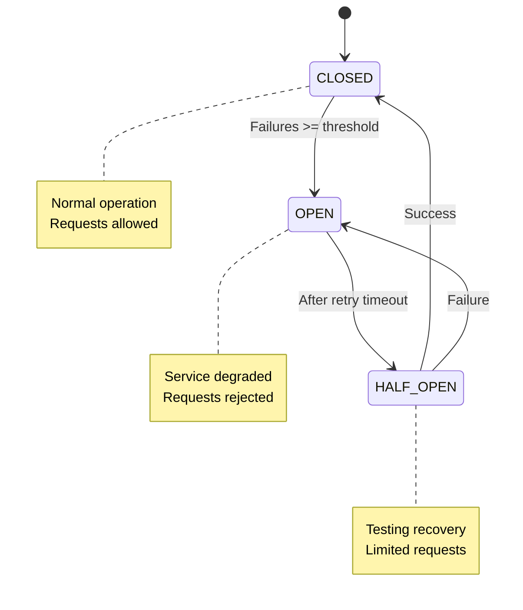

# Advanced Usage Patterns

## Production-Ready Patterns

### 1. Retry Logic with Exponential Backoff

```typescript
import { Injectable, Logger } from '@nestjs/common';
import { InjectSqsQueue, AwsSqsQueue } from 'nestjs-aws-toolkit';

@Injectable()
export class ResilientMessageService {
  private readonly logger = new Logger(ResilientMessageService.name);

  constructor(
    @InjectSqsQueue('orders') private ordersQueue: AwsSqsQueue
  ) {}

  async sendWithRetry(message: any, maxRetries = 3): Promise<boolean> {
    for (let attempt = 1; attempt <= maxRetries; attempt++) {
      try {
        const result = await this.ordersQueue.sendMessage({ body: message });

        if (result) {
          this.logger.log(`Message sent successfully on attempt ${attempt}`);
          return true;
        }
      } catch (error) {
        this.logger.error(`Attempt ${attempt} failed:`, error);

        if (attempt < maxRetries) {
          const delay = Math.pow(2, attempt) * 1000; // Exponential backoff
          this.logger.log(`Retrying in ${delay}ms...`);
          await this.sleep(delay);
        }
      }
    }

    this.logger.error('All retry attempts exhausted');
    return false;
  }

  private sleep(ms: number): Promise<void> {
    return new Promise(resolve => setTimeout(resolve, ms));
  }
}
```

**Backoff Visualization:**

```
Attempt 1: Immediate (0ms)        ───→ ❌ Failed
Attempt 2: Wait 2s (2^1 * 1000)   ───→ ❌ Failed
Attempt 3: Wait 4s (2^2 * 1000)   ───→ ❌ Failed
Attempt 4: Wait 8s (2^3 * 1000)   ───→ ✅ Success!
```

### 2. Circuit Breaker Pattern

```typescript
import { Injectable, Logger } from '@nestjs/common';
import { InjectSqsQueue, AwsSqsQueue } from 'nestjs-aws-toolkit';

enum CircuitState {
  CLOSED = 'CLOSED',   // Normal operation
  OPEN = 'OPEN',       // Failing, reject requests
  HALF_OPEN = 'HALF_OPEN' // Testing if service recovered
}

@Injectable()
export class CircuitBreakerService {
  private readonly logger = new Logger(CircuitBreakerService.name);
  private state: CircuitState = CircuitState.CLOSED;
  private failureCount = 0;
  private lastFailureTime: number = 0;

  private readonly failureThreshold = 5;
  private readonly timeout = 60000; // 1 minute
  private readonly retryTimeout = 30000; // 30 seconds

  constructor(
    @InjectSqsQueue('orders') private ordersQueue: AwsSqsQueue
  ) {}

  async sendMessage(message: any): Promise<boolean> {
    if (this.state === CircuitState.OPEN) {
      if (Date.now() - this.lastFailureTime > this.retryTimeout) {
        this.state = CircuitState.HALF_OPEN;
        this.logger.log('Circuit breaker entering HALF_OPEN state');
      } else {
        this.logger.warn('Circuit breaker is OPEN, rejecting request');
        return false;
      }
    }

    try {
      const result = await this.ordersQueue.sendMessage({ body: message });

      if (result) {
        this.onSuccess();
        return true;
      } else {
        this.onFailure();
        return false;
      }
    } catch (error) {
      this.onFailure();
      throw error;
    }
  }

  private onSuccess(): void {
    this.failureCount = 0;

    if (this.state === CircuitState.HALF_OPEN) {
      this.state = CircuitState.CLOSED;
      this.logger.log('Circuit breaker recovered, state: CLOSED');
    }
  }

  private onFailure(): void {
    this.failureCount++;
    this.lastFailureTime = Date.now();

    if (this.failureCount >= this.failureThreshold) {
      this.state = CircuitState.OPEN;
      this.logger.error(
        `Circuit breaker OPEN after ${this.failureCount} failures`
      );
    }
  }
}
```

**State Diagram:**



### 3. Message Batching with Aggregation

```typescript
import { Injectable, Logger, OnModuleDestroy } from '@nestjs/common';
import { InjectSqsQueue, AwsSqsQueue } from 'nestjs-aws-toolkit';

@Injectable()
export class BatchAggregatorService implements OnModuleDestroy {
  private readonly logger = new Logger(BatchAggregatorService.name);
  private messageBuffer: any[] = [];
  private flushTimer: NodeJS.Timeout | null = null;

  private readonly maxBatchSize = 10;
  private readonly flushInterval = 5000; // 5 seconds

  constructor(
    @InjectSqsQueue('orders') private ordersQueue: AwsSqsQueue
  ) {
    this.startFlushTimer();
  }

  async addMessage(message: any): Promise<void> {
    this.messageBuffer.push(message);
    this.logger.debug(`Buffer size: ${this.messageBuffer.length}/${this.maxBatchSize}`);

    // Flush if batch is full
    if (this.messageBuffer.length >= this.maxBatchSize) {
      await this.flush();
    }
  }

  private async flush(): Promise<void> {
    if (this.messageBuffer.length === 0) return;

    const batch = this.messageBuffer.splice(0, this.maxBatchSize);
    this.logger.log(`Flushing ${batch.length} messages`);

    try {
      const result = await this.ordersQueue.sendMessageBatch({
        bodyList: batch
      });

      if (result) {
        this.logger.log(
          `Batch sent: ${result.Successful?.length} successful, ${result.Failed?.length} failed`
        );
      }
    } catch (error) {
      this.logger.error('Failed to send batch:', error);
      // Re-add failed messages to buffer
      this.messageBuffer.unshift(...batch);
    }
  }

  private startFlushTimer(): void {
    this.flushTimer = setInterval(() => {
      this.flush();
    }, this.flushInterval);
  }

  onModuleDestroy(): void {
    if (this.flushTimer) {
      clearInterval(this.flushTimer);
    }
    // Final flush
    this.flush();
  }
}
```

**Usage:**

```typescript
// Instead of sending immediately
await queue.sendMessage({ body: order }); // ❌ One at a time

// Aggregate and batch
await aggregator.addMessage(order); // ✅ Buffered and batched
```

**Timeline:**

```
0s    1s    2s    3s    4s    5s
│     │     │     │     │     │
├─M1──├─M2──├─M3──├─────├─────├─→ FLUSH (3 messages)
      │     │     │     │     │
      ├─M4──├─M5──├─M6──├─M7──├─→ FLUSH (4 messages)
```

### 4. Priority Queues with Message Attributes

```typescript
import { Injectable } from '@nestjs/common';
import { InjectSqsQueue, AwsSqsQueue } from 'nestjs-aws-toolkit';

enum MessagePriority {
  LOW = 'low',
  NORMAL = 'normal',
  HIGH = 'high',
  URGENT = 'urgent'
}

@Injectable()
export class PriorityQueueService {
  constructor(
    @InjectSqsQueue('orders-high') private highPriorityQueue: AwsSqsQueue,
    @InjectSqsQueue('orders-normal') private normalPriorityQueue: AwsSqsQueue,
    @InjectSqsQueue('orders-low') private lowPriorityQueue: AwsSqsQueue
  ) {}

  async sendOrder(order: any, priority: MessagePriority = MessagePriority.NORMAL) {
    const queue = this.getQueueByPriority(priority);

    return queue.sendMessage({
      body: {
        ...order,
        priority,
        timestamp: Date.now()
      }
    });
  }

  private getQueueByPriority(priority: MessagePriority): AwsSqsQueue {
    switch (priority) {
      case MessagePriority.URGENT:
      case MessagePriority.HIGH:
        return this.highPriorityQueue;
      case MessagePriority.NORMAL:
        return this.normalPriorityQueue;
      case MessagePriority.LOW:
        return this.lowPriorityQueue;
      default:
        return this.normalPriorityQueue;
    }
  }
}
```

**Module Configuration:**

```typescript
@Module({
  imports: [
    AwsSqsModule.registerQueue([
      {
        queueName: 'orders-high',
        sqsQueueUrl: process.env.HIGH_PRIORITY_QUEUE_URL
      },
      {
        queueName: 'orders-normal',
        sqsQueueUrl: process.env.NORMAL_PRIORITY_QUEUE_URL
      },
      {
        queueName: 'orders-low',
        sqsQueueUrl: process.env.LOW_PRIORITY_QUEUE_URL
      }
    ])
  ]
})
export class OrderModule {}
```

### 5. Health Checks and Monitoring

```typescript
import { Injectable } from '@nestjs/common';
import { HealthIndicator, HealthIndicatorResult, HealthCheckError } from '@nestjs/terminus';
import { InjectSqsQueue, AwsSqsQueue } from 'nestjs-aws-toolkit';

@Injectable()
export class SqsHealthIndicator extends HealthIndicator {
  constructor(
    @InjectSqsQueue('orders') private ordersQueue: AwsSqsQueue
  ) {
    super();
  }

  async isHealthy(key: string): Promise<HealthIndicatorResult> {
    try {
      // Test by getting the client (doesn't send actual request)
      const client = this.ordersQueue.getClient();

      if (!client) {
        throw new Error('SQS client not available');
      }

      return this.getStatus(key, true, { message: 'SQS is healthy' });
    } catch (error) {
      throw new HealthCheckError(
        'SQS Health Check failed',
        this.getStatus(key, false, { message: error.message })
      );
    }
  }
}
```

**Health Controller:**

```typescript
import { Controller, Get } from '@nestjs/common';
import { HealthCheck, HealthCheckService } from '@nestjs/terminus';
import { SqsHealthIndicator } from './sqs.health';

@Controller('health')
export class HealthController {
  constructor(
    private health: HealthCheckService,
    private sqsHealth: SqsHealthIndicator
  ) {}

  @Get()
  @HealthCheck()
  check() {
    return this.health.check([
      () => this.sqsHealth.isHealthy('sqs')
    ]);
  }
}
```

### 6. Message Deduplication

```typescript
import { Injectable } from '@nestjs/common';
import { InjectSqsQueue, AwsSqsQueue } from 'nestjs-aws-toolkit';

@Injectable()
export class DeduplicationService {
  private processedMessages = new Set<string>();
  private readonly maxCacheSize = 10000;

  constructor(
    @InjectSqsQueue('orders') private ordersQueue: AwsSqsQueue
  ) {}

  async processMessage(message: any): Promise<boolean> {
    const messageId = this.generateMessageId(message);

    // Check if already processed
    if (this.processedMessages.has(messageId)) {
      console.log('Duplicate message detected, skipping:', messageId);
      return false;
    }

    // Process message
    await this.handleMessage(message);

    // Mark as processed
    this.processedMessages.add(messageId);

    // Prevent memory leak
    if (this.processedMessages.size > this.maxCacheSize) {
      const firstItem = this.processedMessages.values().next().value;
      this.processedMessages.delete(firstItem);
    }

    return true;
  }

  private generateMessageId(message: any): string {
    // Create unique ID based on message content
    return JSON.stringify(message);
    // Or use a hash function:
    // return crypto.createHash('sha256').update(JSON.stringify(message)).digest('hex');
  }

  private async handleMessage(message: any): Promise<void> {
    // Your business logic
  }
}
```

### 7. Graceful Shutdown

```typescript
import { Injectable, OnApplicationShutdown, Logger } from '@nestjs/common';
import { InjectSqsQueue, AwsSqsQueue } from 'nestjs-aws-toolkit';

@Injectable()
export class GracefulShutdownService implements OnApplicationShutdown {
  private readonly logger = new Logger(GracefulShutdownService.name);
  private isShuttingDown = false;
  private activeProcessingCount = 0;

  constructor(
    @InjectSqsQueue('orders') private ordersQueue: AwsSqsQueue
  ) {}

  async onApplicationShutdown(signal?: string): Promise<void> {
    this.logger.log(`Received shutdown signal: ${signal}`);
    this.isShuttingDown = true;

    // Wait for active processing to complete
    while (this.activeProcessingCount > 0) {
      this.logger.log(`Waiting for ${this.activeProcessingCount} messages to finish...`);
      await this.sleep(1000);
    }

    this.logger.log('All messages processed, shutting down gracefully');
  }

  async processMessages(): Promise<void> {
    if (this.isShuttingDown) {
      this.logger.warn('Shutdown in progress, not accepting new messages');
      return;
    }

    const response = await this.ordersQueue.receiveMessage({
      maxNumberOfMessages: 10
    });

    if (!response) return;

    for (const message of response.messages) {
      this.activeProcessingCount++;

      try {
        await this.handleMessage(message.body);
        await message.onMessageComplete();
      } catch (error) {
        this.logger.error('Failed to process message:', error);
      } finally {
        this.activeProcessingCount--;
      }
    }
  }

  private async handleMessage(data: any): Promise<void> {
    // Your processing logic
  }

  private sleep(ms: number): Promise<void> {
    return new Promise(resolve => setTimeout(resolve, ms));
  }
}
```

### 8. Distributed Tracing

```typescript
import { Injectable, Logger } from '@nestjs/common';
import { InjectSqsQueue, AwsSqsQueue } from 'nestjs-aws-toolkit';

interface TracedMessage {
  traceId: string;
  spanId: string;
  parentSpanId?: string;
  timestamp: number;
  data: any;
}

@Injectable()
export class TracedMessageService {
  private readonly logger = new Logger(TracedMessageService.name);

  constructor(
    @InjectSqsQueue('orders') private ordersQueue: AwsSqsQueue
  ) {}

  async sendTracedMessage(data: any, parentSpanId?: string): Promise<void> {
    const traceId = this.generateId();
    const spanId = this.generateId();

    const tracedMessage: TracedMessage = {
      traceId,
      spanId,
      parentSpanId,
      timestamp: Date.now(),
      data
    };

    this.logger.log(`[${traceId}] Sending message with span ${spanId}`);

    await this.ordersQueue.sendMessage({
      body: tracedMessage
    });
  }

  async processTracedMessage(message: TracedMessage): Promise<void> {
    const { traceId, spanId, data } = message;

    this.logger.log(`[${traceId}] Processing message with span ${spanId}`);

    const startTime = Date.now();

    try {
      await this.handleMessage(data);

      const duration = Date.now() - startTime;
      this.logger.log(`[${traceId}] Completed in ${duration}ms`);
    } catch (error) {
      this.logger.error(`[${traceId}] Failed:`, error);
      throw error;
    }
  }

  private generateId(): string {
    return Math.random().toString(36).substring(2, 15);
  }

  private async handleMessage(data: any): Promise<void> {
    // Your business logic
  }
}
```

## Performance Optimization

### Tuning Receive Parameters

```typescript
// ❌ Inefficient: Too many API calls
await queue.receiveMessage({
  maxNumberOfMessages: 1,  // Only 1 message per call
  waitTimeSeconds: 0       // No long polling
});

// ✅ Optimized: Batch receive with long polling
await queue.receiveMessage({
  maxNumberOfMessages: 10,  // Batch receive
  waitTimeSeconds: 20,      // Long polling (reduces API calls)
  visibilityTimeout: 300    // 5 minutes to process
});
```

**Cost Comparison:**

```
Short Polling (waitTimeSeconds: 0):
  • 1000 receives per hour
  • Cost: 1000 * $0.0000004 = $0.0004/hour
  • Empty receives are charged!

Long Polling (waitTimeSeconds: 20):
  • 180 receives per hour (max)
  • Cost: 180 * $0.0000004 = $0.000072/hour
  • 82% cost reduction!
```

## Testing Strategies

### Integration Testing with LocalStack

```typescript
import { Test } from '@nestjs/testing';
import { AwsSqsModule } from 'nestjs-aws-toolkit';

describe('SQS Integration (LocalStack)', () => {
  let app;
  let queue;

  beforeAll(async () => {
    const module = await Test.createTestingModule({
      imports: [
        AwsSqsModule.forRoot({
          region: 'us-east-1',
          credentials: {
            accessKeyId: 'test',
            secretAccessKey: 'test'
          },
          endpoint: 'http://localhost:4566' // LocalStack
        }),
        AwsSqsModule.registerQueue({
          queueName: 'test-queue',
          sqsQueueUrl: 'http://localhost:4566/000000000000/test-queue'
        })
      ]
    }).compile();

    app = module.createNestApplication();
    await app.init();

    queue = module.get(getSqsQueueToken('test-queue'));
  });

  it('should send and receive messages', async () => {
    await queue.sendMessage({ body: { test: 'data' } });

    const response = await queue.receiveMessage({ maxNumberOfMessages: 1 });

    expect(response).toBeDefined();
    expect(response.messages).toHaveLength(1);
    expect(response.messages[0].body).toEqual({ test: 'data' });
  });

  afterAll(async () => {
    await app.close();
  });
});
```

## Next Steps

- **[SQS Module API](../modules/sqs.md)** - Complete API documentation
- **[Configuration Guide](./configuration.md)** - All configuration options
- **[Architecture Overview](../architecture/overview.md)** - Understand the design
