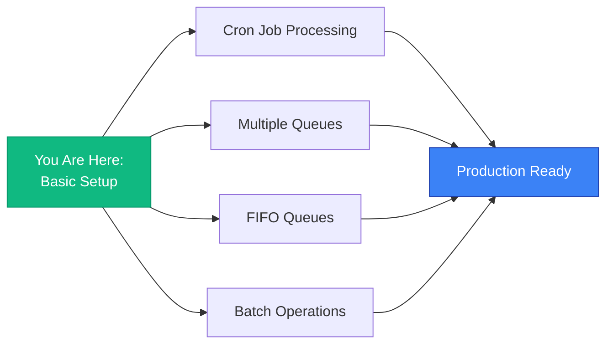

# Getting Started

## Quick Start in 5 Minutes

This guide will get you up and running with the NestJS AWS Toolkit for SQS integration.

### Prerequisites

- Node.js 16+ and npm
- NestJS project initialized
- AWS account with SQS access
- AWS credentials (Access Key ID and Secret Access Key)

### Step 1: Install Dependencies

```bash
npm install nestjs-aws-toolkit @aws-sdk/client-sqs
npm install --save-dev @nestjs/config
```

### Step 2: Set Up Environment Variables

Create a `.env` file in your project root:

```bash
# .env
AWS_SQS_REGION=us-east-1
AWS_SQS_ACCESS_KEY_ID=your_access_key_here
AWS_SQS_SECRET_ACCESS_KEY=your_secret_key_here
MY_QUEUE_URL=https://sqs.us-east-1.amazonaws.com/123456789/my-queue
```

**⚠️ Important:** Add `.env` to your `.gitignore`:

```bash
echo ".env" >> .gitignore
```

### Step 3: Configure Root Module

Update your `app.module.ts`:

```typescript
import { Module } from '@nestjs/common';
import { ConfigModule, ConfigService } from '@nestjs/config';
import { AwsSqsModule } from 'nestjs-aws-toolkit';

@Module({
  imports: [
    // Enable environment variables
    ConfigModule.forRoot({
      isGlobal: true
    }),

    // Configure AWS SQS with shared credentials
    AwsSqsModule.forRootAsync({
      inject: [ConfigService],
      useFactory: (configService: ConfigService) => ({
        region: configService.getOrThrow<string>('AWS_SQS_REGION'),
        credentials: {
          accessKeyId: configService.getOrThrow<string>('AWS_SQS_ACCESS_KEY_ID'),
          secretAccessKey: configService.getOrThrow<string>('AWS_SQS_SECRET_ACCESS_KEY')
        }
      })
    }),

    // Register your first queue
    AwsSqsModule.registerQueueAsync({
      queueName: 'my-queue',
      inject: [ConfigService],
      useFactory: (configService: ConfigService) => ({
        sqsQueueUrl: configService.getOrThrow<string>('MY_QUEUE_URL')
      })
    })
  ]
})
export class AppModule {}
```

### Step 4: Create a Service

Create `app.service.ts`:

```typescript
import { Injectable } from '@nestjs/common';
import { InjectSqsQueue, AwsSqsQueue } from 'nestjs-aws-toolkit';

@Injectable()
export class AppService {
  constructor(
    @InjectSqsQueue('my-queue') private readonly queue: AwsSqsQueue
  ) {}

  async sendMessage(message: string) {
    const result = await this.queue.sendMessage({
      body: { message, timestamp: new Date().toISOString() }
    });

    console.log('Message sent:', result?.MessageId);
    return result;
  }

  async receiveMessages() {
    const response = await this.queue.receiveMessage({
      maxNumberOfMessages: 10,
      waitTimeSeconds: 20
    });

    if (!response) {
      console.log('No messages available');
      return [];
    }

    console.log(`Received ${response.messages.length} messages`);

    for (const message of response.messages) {
      console.log('Message:', message.body);
      await message.onMessageComplete(); // Delete after processing
    }

    return response.messages;
  }
}
```

### Step 5: Create a Controller

Create `app.controller.ts`:

```typescript
import { Controller, Post, Get, Body } from '@nestjs/common';
import { AppService } from './app.service';

@Controller()
export class AppController {
  constructor(private readonly appService: AppService) {}

  @Post('send')
  async sendMessage(@Body('message') message: string) {
    return this.appService.sendMessage(message);
  }

  @Get('receive')
  async receiveMessages() {
    return this.appService.receiveMessages();
  }
}
```

### Step 6: Test Your Integration

Start your application:

```bash
npm run start:dev
```

**Send a message:**

```bash
curl -X POST http://localhost:3000/send \
  -H "Content-Type: application/json" \
  -d '{"message": "Hello from NestJS AWS Toolkit!"}'
```

**Receive messages:**

```bash
curl http://localhost:3000/receive
```

**Expected output:**

```json
[
  {
    "body": {
      "message": "Hello from NestJS AWS Toolkit!",
      "timestamp": "2024-01-15T10:30:00.000Z"
    },
    "receiptHandle": "..."
  }
]
```

## 🎉 Success!

You've successfully integrated AWS SQS with NestJS!

## What's Next?

### Learn More Patterns



### Example: Cron Job Message Processor

```typescript
import { Injectable } from '@nestjs/common';
import { Cron } from '@nestjs/schedule';
import { InjectSqsQueue, AwsSqsQueue } from 'nestjs-aws-toolkit';

@Injectable()
export class MessageProcessor {
  constructor(
    @InjectSqsQueue('my-queue') private readonly queue: AwsSqsQueue
  ) {}

  @Cron('*/10 * * * * *') // Every 10 seconds
  async processMessages() {
    const response = await this.queue.receiveMessage({
      maxNumberOfMessages: 10,
      visibilityTimeout: 30,
      waitTimeSeconds: 20
    });

    if (!response) return;

    for (const message of response.messages) {
      try {
        await this.handleMessage(message.body);
        await message.onMessageComplete(); // Delete on success
      } catch (error) {
        console.error('Failed to process message:', error);
        // Message will be retried automatically
      }
    }
  }

  private async handleMessage(data: any) {
    console.log('Processing:', data);
    // Your business logic here
  }
}
```

Don't forget to install `@nestjs/schedule`:

```bash
npm install @nestjs/schedule
```

And import it in `app.module.ts`:

```typescript
import { ScheduleModule } from '@nestjs/schedule';

@Module({
  imports: [
    ScheduleModule.forRoot(),
    // ... other imports
  ]
})
export class AppModule {}
```

## Common Issues

### Issue: "Invalid options provided"

**Solution:** Ensure all environment variables are set correctly in `.env`.

### Issue: "Access Denied" from AWS

**Solution:** Check that your AWS credentials have SQS permissions:

```json
{
  "Version": "2012-10-17",
  "Statement": [
    {
      "Effect": "Allow",
      "Action": [
        "sqs:SendMessage",
        "sqs:ReceiveMessage",
        "sqs:DeleteMessage",
        "sqs:GetQueueAttributes"
      ],
      "Resource": "arn:aws:sqs:us-east-1:123456789:my-queue"
    }
  ]
}
```

### Issue: Messages not being deleted

**Solution:** Make sure to call `onMessageComplete()` after processing:

```typescript
for (const message of response.messages) {
  await this.processMessage(message.body);
  await message.onMessageComplete(); // ← Don't forget this!
}
```

## Next Steps

- **[Configuration Guide](./configuration.md)** - Advanced configuration options
- **[SQS Module Documentation](../modules/sqs.md)** - Complete API reference
- **[Advanced Usage](./advanced-usage.md)** - Production patterns
- **[Architecture Overview](../architecture/overview.md)** - Understand the design

## Resources

- [AWS SQS Documentation](https://docs.aws.amazon.com/sqs/)
- [NestJS Documentation](https://docs.nestjs.com/)
- [GitHub Repository](https://github.com/yourusername/nestjs-aws-toolkit)
